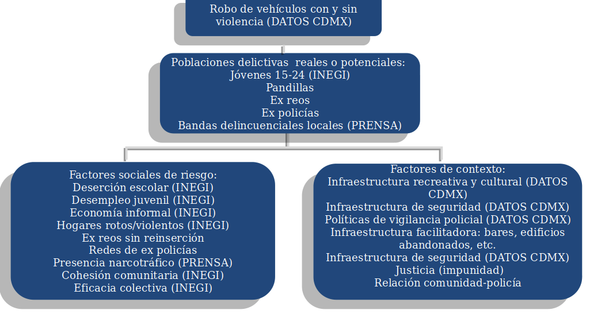

# Final_Aprendizaje_de_maquina
Predicción de número de robos de vehículos por ageb en la Ciudad de México
**Integrantes del equipo**  

| Nombre                          |     CU   | Mail                    | Usuario Gh                                    |
| :-----------------------------: | :------: | :---------------------: | :-------------------------------------------: |
| Nayeli Arenas Morales           | 084351  | nayeli.arenas@itam.mx   | [arenitss](https://github.com/arenitss) |
| Uriel Abraham Rangel Díaz       | 193921   | urangeld@itam.mx        | [urieluard](https://github.com/urieluard)     |
| José Luis Roberto Zárate Cortés | 183347   | jzaratec@itam.mx        | [jlrzarcor](https://github.com/jlrzarcor)     

## Objetivo

## El modelo

