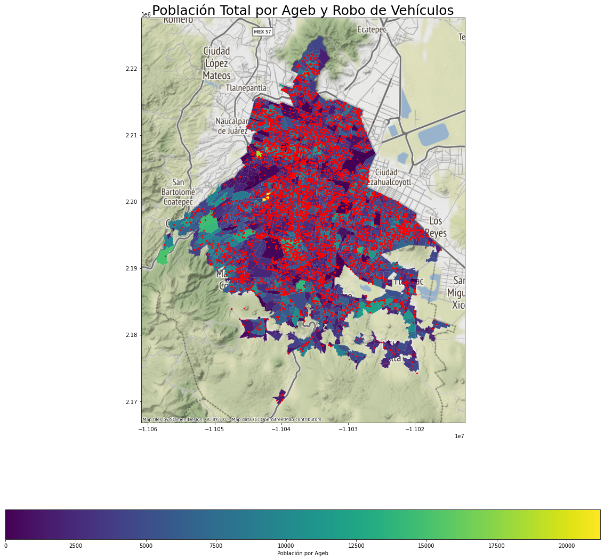
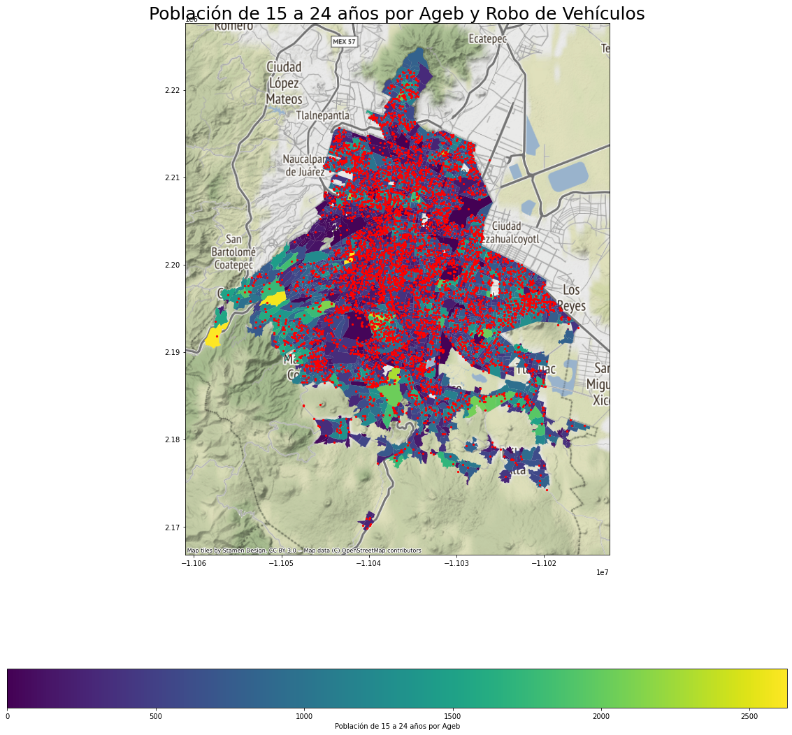

### Fuentes

Las fuentes de información que se emplearon para este trabajo son las siguientes:

- [Claves y Polígonos de AGEB](https://www.inegi.org.mx/app/biblioteca/ficha.html?upc=889463807469)

Esta base de datos es generada por el INEGI y contiene las claves de las entidades federativas, los municipios y las localidades a la que pertenece cada AGEB; así como las coordenadas georreferenciadas que definen el polígono territorial que cubre cada AGEB.

El AGEB se define como la extensión territorial que corresponde a la subdivisión de las áreas geoestadísticas municipales y, dependiendo de sus características, se clasifican en dos tipos: AGEB urbana y AGEB rural. Las AGEB urbanas corresponden al área geográfica ocupada por un conjunto de manzanas perfectamente delimitadas por calles, avenidas, andadores o cualquierotro rasgo de fácil identificación en el terreno y cuyo uso de suelo es principalmente habitacional, industrial, de servicios, comercial, entre otros, y sólo son asignados al interior de localidades urbanas. Las AGEB que no formen parte de la descripción anterior son considerardadas rurales.

- [Marco Geoestadístico. Censo de Población y Vivienda 2020](https://www.inegi.org.mx/programas/ccpv/2020/default.html#Microdatos)

Esta base de datos corresponde al Censo de Población y Vivienda realizado por el INEGI en 2020 (Censo en adelante) y, de acuerdo con la [documentación](https://www.inegi.org.mx/app/scitel/doc/descriptor/fd_agebmza_urbana_cpv2020.pdf) de la entidad, "se incluye una selección de indicadores sobre las características sociodemográficas de la población y las viviendas de las localidades urbanas del país, generados con los resultados del **Censo de Población y Vivienda 2020** desagregados hasta el nivel de área geoestadística básica (AGEB) y manzana urbana."

Las variables relativas a la Población que se recabaron en el censo son de los siguientes factores: sexo, edad, fecundidad, Migración, etnicidad, discapacidad, educación, características económicas, servicios de salud, situación conyugal y religión. Porotro lado, en cuanto a lo que se refiere a Vivienda se cubren los siguientes campos: viviendas y ocupantes, material de piso, número de cuartos, servicios y bienes con los que cuenta. El detalle de cada uno de los 222 indicadores que se consultaron para cada uno de los 64,313 AGEB que componen a la base de datos se pueden consultar en este [link](https://www.inegi.org.mx/app/scitel/doc/descriptor/fd_agebmza_urbana_cpv2020.pdf).

- [Carpetas de investigación PGJ de la Ciudad de México (archivo)](https://datos.cdmx.gob.mx/dataset/carpetas-de-investigacion-pgj-cdmx/resource/3f308147-b1fc-49a9-92b7-e74f3f79aa9c)

En esta base de datos encontramos las Carpetas de Investigación de delitos a nivel calle de la Procuraduría General de Justicia de la Ciudad de México desde enero 2016 hasta junio 2019 (Delitos en adelante). Cuenta con 19 variables, que nos indican la información más rlevante del delito cometido y nos permiten responder las preguntas: ¿Cuándo se cometió? ¿Dónde ocurrió? ¿Qué tipo de delito fue? ¿Quién lo está investiganso? De estas, las variables de mayor interés son el tipo de delito y el lugar donde se cometió (con coordenadas de latitud y longitud). El delito que estamos interesados en investigar, y que corresponde a nuestra variable respuesta, es el tipificado como Robo de vehículo, sin embargo, también se extraen otros delitos que podrían estar relacionados con este fenómeno: Violencia familiar, Amenazas, Fraude, Robos de objetos, Robos de objetos al interior de un vehículo, Robo a transeunte, Robo de accesorios de auto, Robo a negocio sin violencia, Narcomenudeo con posesión simple y Robo a casa habitación sin violencia.

- [WiFi gratuito en Postes del C5](https://datos.cdmx.gob.mx/dataset/ubicacion-acceso-gratuito-internet-wifi-c5)

Estos postes son parte del Centro de Comando, Control, Cómputo, Comunicaciones y Contacto Ciudadano (C5) de la Ciudad de México que cuentan con conexión gratuita a internet para la ciudadanía, además de servicios de video monitoreo, atención llamadas de emergencia, denuncias anónimas y servicio de LOCATEL. 

En la base de datos utilizada se cuneta con la georrefernciación (latitud y longitud) de cada uno de los postes del C5 que cuentan con estos servicios.

### Limpieza

Ambas bases de datos fueron analizadas y se realizó un proceso de limpieza y transformación que consistió en los siguientes puntos:

Para la base de datos del Censo no hubo necesidad de realizar ninguna limpieza, sin embargo si se creó una nueva variable:

- Se agruparon dos categorías de población en una. De modeo que los grupos de edades de 15 a 17 y de 18 a 24 se integraron en una sola categoría: de 15 a 24. Se hizo una variable con el total de la población en ese rango y otra solo para hombres en ese mismo rango de edad. Esta agrupación se realizó para capturar lo que se ha observado en estudios como la Encuesta NAcional de Victimización y Percepción sobre Seguridad Pública (ENVIPE) donde se indica que en este rango de edad existe una concentración de población con propensión a delinquir.
- Se creó una nueva variable que posteriormente se utiliza para relacionar la base de datos del Censo con las otras utilizadas

Para la base de datos de Delitos:

- Se descartaron los registros que no tenían información de coordenadas (latitud y/o longitud)
- Creación de una nueva variable formada por los valores de latitud y longitud  

### Proceso de cruce de Bases de Datos

Debido a que la información del Censo se tiene ubicada por AGEB y las otras bases de datos tienen información de ubicación en coordenadas geográficas de latitud y longitud, para poder generar una sola base de datos se requiere identificar la información de las observaciones que tienen puntos georreferenciados con su correspondiente AGEB. Para ello se utiliza el formato Coordinate Reference Systems (CRS) para homologar los puntos de ambas bases. En la Figura siguiente el resultado del cruce realizado entre las AGEB y los punts donde se han presentado robos de vehículos:

    

Siguienedo este mismo proceso se realiza el cruce ahora entre la base de datos de Delitos con la del Censo y los polígonos de AGEB. Con esto podemos crear los siguientes mapas:

    

    

    

Finalmente, se agraga la información de los postescon WiFi de la Ciudad de México, realizando el mismo procedimiento de identificar AGEB para cada punto georreferenciado y cruzar con la base de datos que ya incluye las variables del Censo y las de Delitos. El resultado final es una base de datos que incluye las variables de interés del Censo, Delitosy Postes WiFi, todas relacionadas al AGEB a la que pertenecen.

