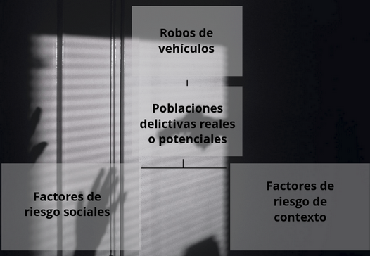

## Modelo de Prevención 

El modelo teórico de prevención de la violencia que se toma en este proyecto es una propuesta del Lic. Guillermo Valadés Castellanos[1]. Este modelo tiene como propósito la implementación de políticas públicas tomando como punto de partida aquellas variables que tienen mayor relación con la incidencia delictiva. Del mismo modo, la propuesta intenta segmentar geográficamente el tipo de política dependiendo de las necesidades especificas de cada región.

El modelo considera los siguientes puntos de partida:

1. Sobre las causas de la delincuencia
2. Sobre los tipos de delincuencia
3. Sobre los tipos de prevención

### Sobre las Causas de la delincuencia

Existe la tesis general que sostiene que algunas situaciones sociales y económicas, como la pobreza, la desigualdad, la falta de oportunidades económicas y/o educativas, etc. son causas de la delincuencia. Sin embargo, no existe una relación causal. Pueden ser condiciones necesarias, en algunos casos, aunque no suficientes. Por lo tanto es indispensable, encontrar otras variables sociales, más concretas, que operan como factores de riesgo o detonantes de la actividad delictiva.

Existen dos tipos de factores de riesgo:

1. Los sociales. Que afectan directamente a los grupos sociales propensos a la comisión de delitos, por ejemplo, el nivel de violencia familiar
2. Los de contexto. Se refieren a la existencia de espacios físicos proclives para el crimen o las deficiencias de la vigilancia policial.

Esto quiere decir, que las variables estructurales sociales y económicas sólo operan cuando están presentes los factores de riesgo. Por ejemplo, que un joven haya abandonado la escuela y se encuentre desempleado, no es causa suficiente para que se convierta en delincuente. Se requiere además, que sea miembro de alguna pandilla, sea víctima de violencia familiar, consuma drogas y existan factores externos que faciliten la comisión de un delito, como escasa vigilancia policíaca y alto nivel de impunidad.

### Sobre los tipos de delincuencia

La delincuencia puede clasificarse por tipo de actor delictivo. Existen delitos que se comenten por individuos aislados, grupos juveniles o pandillas, bandas locales y finalmente por agrupaciones del crimen organizado (carteles).


### Sobre los tipos de prevención

* Directa. Opera sobre variables inmediatas y los actores directos o potenciales.

    1. Jóvenes propensos a la comisión de delitos
    2. Delincuentes individuales o en grupo, pero no carteles
    3. Factores de riesgo

* Indirecta. Sobre causas estructurales, como desigualdad social.

## Desarrollo

Este modelo se centra en delitos cometidos por individuos aislados, pandillas y bandas; se focaliza en la disminución de factores de riesgo; y debido a que sólo se cuenta con el número de carpetas de investigación reportadas por la Fiscalía de la Ciudad de México, se eligió el robo de vehículos como delito a estudiar debido a que el nivel de registros es mayor que el de otros incidentes, donde la cifra negra ronda porcentajes cercanos a 99%. Es importante mencionar, que debido a que se cuenta con información pública, únicamente, buena parte del trabajo de este proyecto es la recopilación y adecuación de las variables integradas de varias fuentes disponibles como los datos de Ciudad de México y el Instituto Nacional de Estadística y Geografía (INEGI).

La implementación de este modelo se realizó, en primer lugar, tomando como variable dependiente el número de robos de vehículos. Mediante una regresión lineal se intentó encontrar aquellas variables más importantes en el modelo. Sin embargo, debido a la naturaleza de los datos, los cuales están segmentados por la unidad geográfica mínima que realiza el Instituto Nacional de Estadística y Geografía (INEGI) se encontró que la mediana de los datos es 0 y cerca de 75% de las aŕeas geográficas tienen menos de 3 robos de vehículos durante 2020, lo que convierte nuestra base de datos en una base rala.

Por tanto, en un segundo intento por encontrar las variables que se encuentran más relacionadas con el robo de vehículos, se modificó la variable dependiente (número de robos de vehículos) convirtiendola en una variable binomial. Dicha variable marca 0 si en el área geográfica básica (AGEB) no se reportaron robos y 1 si se reportó alguno.


## Diagnóstico
La base de datos está estructurada por AGEB, es decir, cada renglón contiene la información correspondiente a cada una una delas demarcaciones territoriales básicas de la Ciudad de México durante 2020.

* Población delincuencial potencial y real
  1. pop_15_24. Población de 15 a 24 años (INEGI)
  2. union_tepito. Si la AGEB pertenece a una alcaldía donde opera dicha banda o cartel (Prensa)
  3. cjng. Si la AGEB pertenece a una alcaldía donde opera dicha banda o cartel (Prensa)
  4. cartel_de_tlahuac. Si la AGEB pertenece a una alcaldía donde opera dicha banda o cartel (Prensa)
  5. lenin_canchola. Si la AGEB pertenece a una alcaldía donde opera dicha banda o cartel (Prensa)
  6. anti_union_tepito. Si la AGEB pertenece a una alcaldía donde opera dicha banda o cartel (Prensa)
  7. rodolfos Alcaldía. Si la AGEB pertenece a una alcaldía donde opera dicha banda o cartel (Prensa)

* Causas estructurales
  1. P15A24A. Población de 15 a 24 años que asiste a la escuela (INEGI)
  2. GRAPROES. Resultado de dividir el monto de grados escolares aprobados por las personas de 15 a 130 años de edad entre las personas del mismo grupo de edad (INEGI)
  3.. PEA. Personas de 12 a 130 años de edad que trabajaron, tenían trabajo pero no trabajaron o buscaron trabajo en la semana de referencia (INEGI)
  4.. POCUPADA. Personas de 12 a 130 años de edad que trabajaron o que no trabajaron, pero sí tenían trabajo en la semana de referencia (INEGI)
  5. PDESOCUP. Personas de 12 a 130 años de edad que no tenían trabajo, pero buscaron trabajo en la semana de referencia (INEGI)
  6. PSINDER. Total de personas que no están afiliadas a servicios médicos en ninguna institución pública o privada (INEGI)
  7. PRO_OCUP_C. Resultado de dividir el número de personas que residen en viviendas particulares habitadas entre el número de cuartos de esas viviendas (INEGI)
  8 .VPH_PISOTI. Viviendas particulares habitadas con piso de tierra (INEGI)
  9. VPH_S_ELEC. Viviendas particulares habitadas que no tienen energía eléctrica (INEGI)
  10.VPH_AGUAFV. Viviendas particulares habitadas que no tienen disponibilidad de agua entubada (INEGI)
  11. VPH_NODREN. Viviendas particulares habitadas que no tienen drenaje (INEGI)
  12.VPH_INTER. Viviendas particulares que disponen de internet (INEGI)


* Factores de riesgo sociales
1. PHOGJEF_F. Personas en hogares censales donde la persona de referencia es mujer (INEGI)

* Factores de riesgo de contexto
  1. VIVPAR_DES. Viviendas particulares deshabitadas (INEGI)
  2. Postes_Wifi. Número de postes con acceso a wifi por AGEB (Datos  CDMX)
  3. Amenzas. Número de delitos por AGEB (Datos CDMX)
  4. Fraude. Número de delitos por AGEB (Datos CDMX)
  5. Robo_Objetos. Número de delitos por AGEB (Datos CDMX)
  6. Robo_Objetos_Vehiculo. Número de delitos por AGEB (Datos CDMX)
  7. Robo_Transeunte. Número de delitos por AGEB (Datos CDMX)
  8. Robo_Accesorios_Autos. Número de delitos por AGEB (Datos CDMX)
  9. Robo_Negocio_Sin_Violencia_Autoservicio. Número de delitos por AGEB (Datos CDMX)
  10. Robo_Negocio_Sin_Violencia. Número de delitos por AGEB(Datos CDMX)
  11. Narcomenudeo. Número de delitos por AGEB (Datos CDMX)
  12. Robo_Casa_Sin_Violencia . Número de delitos por AGEB(Datos CDMX)



### Fuentes

Las fuentes de información que se emplearon para este trabajo son las siguientes:

- [Claves y Polígonos de AGEB](https://www.inegi.org.mx/app/biblioteca/ficha.html?upc=889463807469)

Esta base de datos es generada por el INEGI y contiene las claves de las entidades federativas, los municipios y las localidades a la que pertenece cada AGEB; así como las coordenadas georreferenciadas que definen el polígono territorial que cubre cada AGEB.

El AGEB se define como la extensión territorial que corresponde a la subdivisión de las áreas geoestadísticas municipales y, dependiendo de sus características, se clasifican en dos tipos: AGEB urbana y AGEB rural. Las AGEB urbanas corresponden al área geográfica ocupada por un conjunto de manzanas perfectamente delimitadas por calles, avenidas, andadores o cualquierotro rasgo de fácil identificación en el terreno y cuyo uso de suelo es principalmente habitacional, industrial, de servicios, comercial, entre otros, y sólo son asignados al interior de localidades urbanas. Las AGEB que no formen parte de la descripción anterior son considerardadas rurales.

- [Marco Geoestadístico. Censo de Población y Vivienda 2020](https://www.inegi.org.mx/programas/ccpv/2020/default.html#Microdatos)

Esta base de datos corresponde al Censo de Población y Vivienda realizado por el INEGI en 2020 (Censo en adelante) y, de acuerdo con la [documentación](https://www.inegi.org.mx/app/scitel/doc/descriptor/fd_agebmza_urbana_cpv2020.pdf) de la entidad, "se incluye una selección de indicadores sobre las características sociodemográficas de la población y las viviendas de las localidades urbanas del país, generados con los resultados del **Censo de Población y Vivienda 2020** desagregados hasta el nivel de área geoestadística básica (AGEB) y manzana urbana."

Las variables relativas a la Población que se recabaron en el censo son de los siguientes factores: sexo, edad, fecundidad, Migración, etnicidad, discapacidad, educación, características económicas, servicios de salud, situación conyugal y religión. Porotro lado, en cuanto a lo que se refiere a Vivienda se cubren los siguientes campos: viviendas y ocupantes, material de piso, número de cuartos, servicios y bienes con los que cuenta. El detalle de cada uno de los 222 indicadores que se consultaron para cada uno de los 64,313 AGEB que componen a la base de datos se pueden consultar en este [link](https://www.inegi.org.mx/app/scitel/doc/descriptor/fd_agebmza_urbana_cpv2020.pdf).

- [Carpetas de investigación PGJ de la Ciudad de México (archivo)](https://datos.cdmx.gob.mx/dataset/carpetas-de-investigacion-pgj-cdmx/resource/3f308147-b1fc-49a9-92b7-e74f3f79aa9c)

En esta base de datos encontramos las Carpetas de Investigación de delitos a nivel calle de la Procuraduría General de Justicia de la Ciudad de México desde enero 2016 hasta junio 2019 (Delitos en adelante). Cuenta con 19 variables, que nos indican la información más rlevante del delito cometido y nos permiten responder las preguntas: ¿Cuándo se cometió? ¿Dónde ocurrió? ¿Qué tipo de delito fue? ¿Quién lo está investiganso? De estas, las variables de mayor interés son el tipo de delito y el lugar donde se cometió (con coordenadas de latitud y longitud). El delito que estamos interesados en investigar, y que corresponde a nuestra variable respuesta, es el tipificado como Robo de vehículo, sin embargo, también se extraen otros delitos que podrían estar relacionados con este fenómeno: Violencia familiar, Amenazas, Fraude, Robos de objetos, Robos de objetos al interior de un vehículo, Robo a transeunte, Robo de accesorios de auto, Robo a negocio sin violencia, Narcomenudeo con posesión simple y Robo a casa habitación sin violencia.

- [WiFi gratuito en Postes del C5](https://datos.cdmx.gob.mx/dataset/ubicacion-acceso-gratuito-internet-wifi-c5)

Estos postes son parte del Centro de Comando, Control, Cómputo, Comunicaciones y Contacto Ciudadano (C5) de la Ciudad de México que cuentan con conexión gratuita a internet para la ciudadanía, además de servicios de video monitoreo, atención llamadas de emergencia, denuncias anónimas y servicio de LOCATEL. 

En la base de datos utilizada se cuneta con la georrefernciación (latitud y longitud) de cada uno de los postes del C5 que cuentan con estos servicios.

### Limpieza

Ambas bases de datos fueron analizadas y se realizó un proceso de limpieza y transformación que consistió en los siguientes puntos:

Para la base de datos del Censo:

- Se agruparon dos categorías de población en una. De modeo que los grupos de edades de 15 a 17 y de 18 a 24 se integraron en una sola categoría: de 15 a 24. Se hizo una variable con el total de la población en ese rango y otra solo para hombres en ese mismo rango de edad. Esta agrupación se realizó para capturar lo que se ha observado en estudios como la Encuesta NAcional de Victimización y Percepción sobre Seguridad Pública (ENVIPE) donde se indica que en este rango de edad existe una concentración de población con propensión a delinquir.
- Se corrigen los caracteres incorrectos en la vairiable nombre del municipio
- Se creó una nueva variable que posteriormente se utiliza para relacionar la base de datos del Censo con las otras utilizadas.
- En relación con las variables que indican el grado de desarrollo humano al observar alta presencia de NA's y 0's en las variables relacionadas con características de la vivienda (piso de tierra, sin agua entubada, sin drenaje y sin energía eléctrica), se concluye que al ser un análisis en la CDMX tienen poca o nula variabilidad pues, aunque si existen zonas marginadas, al encontrarnos en una zona mayormente urbana éstas no son relevantes para nuestro análisis. Por esta razón se eliminaron. Aunque la información relacionada con desarrollo humano es capturada por las variables de servicios de internet y afiliación a servicios de salud.
- Durante nuestra etapa de modelado, descubrimos que existen 17 AGEBS con POBTOT = 0 y que esto se replica en todas las variables relacionadas a población, por lo que podemos eliminar estos registros al no representar perdida de información siginificativa (17 de +2000)
- Las variables relacionadas con la población afiliada a servicios médicos, hogares cuya jefe de falia es una mujer, viviendas desocupadas y población nacida en otra entidad se relativizan utilizando tasas por cada mil habitantes.


Para la base de datos de Delitos:

- Se descartaron los registros que no tenían información de coordenadas (latitud y/o longitud)
- Creación de una nueva variable formada por los valores de latitud y longitud 
- Los datos nulos se imputan con cero
- Se agregan en una sola variable todos los delitos de robos y en "otras" los de delitos de fraude, amenazas y narcomenudeo
- Se modifica la variable dependiente (número de robos de vehículos) a una variable binomial. Dicha variable marca 0 si en la AGEB no se reportaron robos y 1 si se reportó alguno.

Para la base de datos de Poste_Wifi:
- Los datos nulos se imputan con cero


### Proceso de cruce de Bases de Datos

Debido a que la información del Censo se tiene ubicada por AGEB y las otras bases de datos tienen información de ubicación en coordenadas geográficas de latitud y longitud, para poder generar una sola base de datos se requiere identificar la información de las observaciones que tienen puntos georreferenciados con su correspondiente AGEB. Para ello se utiliza el formato Coordinate Reference Systems (CRS) para homologar los puntos de ambas bases. En la Figura siguiente el resultado del cruce realizado entre las AGEB y los punts donde se han presentado robos de vehículos:

<p align = "center">
    

Siguienedo este mismo proceso se realiza el cruce ahora entre la base de datos de Delitos con la del Censo y los polígonos de AGEB. Con esto podemos crear los siguientes mapas:

<p align = "center">
    

<p align = "center">
    

<p align = "center">
    

Finalmente, se agraga la información de los postescon WiFi de la Ciudad de México, realizando el mismo procedimiento de identificar AGEB para cada punto georreferenciado y cruzar con la base de datos que ya incluye las variables del Censo y las de Delitos. El resultado final es una base de datos que incluye las variables de interés del Censo, Delitosy Postes WiFi, todas relacionadas al AGEB a la que pertenecen.


```{r}
knitr::opts_chunk$set(echo = FALSE)


## ID_F0 --> This function aim to install and load libraries required.
rm(list = ls())

instalar <- function(paquete) {
  if (!require(paquete,character.only = TRUE, quietly = TRUE,
               warn.conflicts = FALSE)) {
    install.packages(as.character(paquete), dependecies = TRUE,
                     repos = "http://cran.us.r-project.org")
    library(paquete, character.only = TRUE, quietly = TRUE,
            warn.conflicts = FALSE)
  }
}
    
## *******   Defining required libraries to install and load   *******

## Use this vector to indicate libraries to load.
paquetes <- c("tensorflow", "keras", "tidyverse","stringi",
              "tidymodels", "glmnet", "kknn","gt","ranger")

invisible(lapply(paquetes, instalar))

## Load piping files and review of working libraries

source("../src/utils/utils.R", encoding = 'UTF-8')

```


### DATABASE


```{r}

# Importar archivo y codificar

csv_file <- readLines("../data/ageb_censo_delitos_wifi.csv")
csv_utf <- iconv(csv_file,"latin1", "UTF-8") # produces an error

#database <- read_csv(csv_utf, skip_empty_rows = TRUE)
#database

database <- read_csv("../data/ageb_censo_delitos_wifi.csv")
```

## Tidy Process

Lo primero que haremos es observar la configuración y salud de nuestros datos
para iniciar el proceso de limpieza y construcción de variables derivadas
relevantes para nuestro análisis.

```{r}
# *******   Preview of Dataset   *******
ageb_censo_delitos_wifi <- database
glimpse(ageb_censo_delitos_wifi)
summary(ageb_censo_delitos_wifi)
```


### LIMPIEZA
```{r}

# cleaning column_name

nom_cols <-  colnames (ageb_censo_delitos_wifi)
nom_cols <- str_replace_all(tolower(nom_cols),pattern = "/| |-",replacement = '_')
nom_cols <- str_replace_all(tolower(nom_cols), pattern = ":|::|\\.", replacement = '')
nom_cols <- str_replace_all(tolower(nom_cols), pattern = "#", replacement = 'num')
nom_cols <- stri_enc_toutf8(nom_cols)

colnames(ageb_censo_delitos_wifi) <- nom_cols


# categorical columns
v_cat <- c("nom_mun")
ageb_censo_delitos_wifi <- ageb_censo_delitos_wifi %>%
  mutate(across(all_of(v_cat), ~ as.factor(.x)))

# Observamos algunas variables numéricas referentes a población-viviendas-delitos.
# En la documentación del CENSO se indica que es un valor no especificado, por
# lo que, para este ejercicio, hemos acordado sustituir NA's con 0 de las columnas:
    # 1. Delitos, NA -> no hubo delitos en esa AGEB
    # 2. Postes_wifi, NA -> no existen puntos de acceso a wifi en esa AGEB
    # 3. Población, NA -> no se tienen registros de personas en la AGEb
    # 4. Viviendas-Hogares, NA -> no se tienen registros de viviendas|hogares

v_cat <- c(10:26, 30:44, 47:65)
ageb_censo_delitos_wifi <- ageb_censo_delitos_wifi %>%
  mutate(across(all_of(v_cat), ~ ifelse(is.na(.x)==TRUE,0,.x)))

# Remove irrelevant columns: Quitamos la primera columna (índice) y
# la variable NOM_ENT -> Ciudad de México
ageb_censo_delitos_wifi <- ageb_censo_delitos_wifi %>% select(-1, -nom_ent)


# Corregimos los caracteres incorrectos en la variable nombre del municipio.
ageb_censo_delitos_wifi$nom_mun <- ageb_censo_delitos_wifi$nom_mun %>%
  fct_relabel(~ gsub("µ", "a", .x))
ageb_censo_delitos_wifi$nom_mun <- ageb_censo_delitos_wifi$nom_mun %>%
  fct_relabel(~ gsub("¢", "o", .x))
ageb_censo_delitos_wifi$nom_mun <- ageb_censo_delitos_wifi$nom_mun %>%
  fct_relabel(~ gsub("\u0082", "e", .x))
ageb_censo_delitos_wifi$nom_mun <- ageb_censo_delitos_wifi$nom_mun %>%
  fct_relabel(~ gsub("\\.", "", .x))
ageb_censo_delitos_wifi$nom_mun <- ageb_censo_delitos_wifi$nom_mun %>%
  fct_relabel(~ gsub(" ", "_", .x))
ageb_censo_delitos_wifi$nom_mun <- ageb_censo_delitos_wifi$nom_mun %>%
  fct_relabel( ~ str_replace_all(tolower(.x), pattern = "\\s", replacement = "a"))


# Creamos la variable de población que entre 15 y 24 años que no asiste a la escuela
ageb_censo_delitos_wifi <- ageb_censo_delitos_wifi %>%
  mutate(p15a24a = p15a17a + p18a24a)

ageb_censo_delitos_wifi <- ageb_censo_delitos_wifi %>%
  mutate(p15a24a_f = p15a17a_f + p18a24a_f)

ageb_censo_delitos_wifi <- ageb_censo_delitos_wifi %>%
  mutate(p15a24a_m = p15a17a_m + p18a24a_m)


ageb_censo_delitos_wifi <- ageb_censo_delitos_wifi %>%
  mutate(p_15a24 = p_15a17 + p_18a24)

ageb_censo_delitos_wifi <- ageb_censo_delitos_wifi %>%
  mutate(p_15a24_f = p_15a17_f + p_18a24_f)

ageb_censo_delitos_wifi <- ageb_censo_delitos_wifi %>%
  mutate(p_15a24_m = p_15a17_m + p_18a24_m)


# Eliminamos las variables que ya no son necesarias. Se valida que las variables
# pop_15_24, pop_15_24_H contienen información duplicada con las nuevas var.

ageb_censo_delitos_wifi <- ageb_censo_delitos_wifi %>%
  select(-p_15a17, -p_18a24, -p_15a17_m, -p_18a24_m, -p_15a17_f, -p_18a24_f,
         -p15a17a, -p18a24a, -p15a17a_f, -p18a24a_f, -p15a17a_m, -p18a24a_m,
         -pop_15_24,-pop_15_24_h)

# Relocate variables:
    # --> Pasamos Robo de vehículos al inicio de la base
ageb_censo_delitos_wifi <- ageb_censo_delitos_wifi %>%
  relocate(robo_vehículos)


    # --> Movemos las variables de población con el resto de variables relacionadas
ageb_censo_delitos_wifi <- ageb_censo_delitos_wifi %>%
  relocate(matches("^p15"), .before = pnacoe) %>%
  relocate(matches("^p_15"), .before = pnacoe)

# Creamos la variable de agrupación (al final del proceso de limpieza se explica la razón de esta variable.)
    # Se Validó que la extracción de caracteres 3 al 9 de cvegeo y la concatenación
    # de cve_mun_x con cve_loc_x fueran iguales (all TRUE). Se conserva script.

    #table(ageb_censo_delitos_wifi %>% mutate(cadena1 = str_sub(cvegeo,3,9),
    #                                   cadena2 = stri_join(cve_mun_x, cve_loc_x),
    #                                   compare = cadena1==cadena2) %>%
    #  relocate(cadena1, cadena2, compare) %>% pull(compare))
ageb_censo_delitos_wifi <- ageb_censo_delitos_wifi %>%
  mutate(id_mun_loc = str_sub(cvegeo,3,9)) %>% 
  relocate(id_mun_loc, .after = cvegeo)


```


En relación a las variables que indican el grado de desarrollo urbano:

>vph_inter (internet), psinder (no afiliación serv. salud), vph_pisoti (piso tierra),
vph_s_elec (no electricidad), vph_aguafv (no agua potable), vph_nodren (no drenaje)

al observar alta presencia de NA's y 0's en las últimas cuatro variables, se
concluye que al ser un análisis en la CDMX tienen poca o nula variabilidad
pues, aunque si existen zonas marginadas, estas no son relevantes para nuestro
análisis. Por esta razón se eliminarán.

Por otro lado, las variables de servicios de internet y afiliación a servicios
de salud, consideramos que sí podría existir cierto grado de relación con
respecto al robo de vehículos.


```{r}
# Eliminamos las variables vph
ageb_censo_delitos_wifi <- ageb_censo_delitos_wifi %>%
  select(-vph_pisoti, -vph_s_elec, -vph_aguafv, -vph_nodren)
```


Durante nuestra etapa de modelado, descubrimos que existen 17 AGEBS con POBTOT = 0
y que esto se replica en todas las variables relacionadas a población. Al revisar
la variable objetivo de estas observaciones, nos percatamos que se tienen varios
registros con NA, veamos:

```{r}
database %>% filter(POBTOT == 0) %>% select(matches("^P|^Robo"))
```

por lo que podemos eliminar estos registros al no representar
perdida de información siginificativa (17 de +2000)


```{r}
ageb_censo_delitos_wifi <- ageb_censo_delitos_wifi %>%
  filter(pobtot != 0)
```


Con el preprocesamiento anterior, se ejecutaron algunos modelos a nivel AGEB, donde
uno de los principales hallazgos es que las observaciones (robo de vehículos)
a este nivel son sumamente ralos, lo que dificulta un modelado adecuado.

A este punto, revisamos la información y hemos decidido que la mejor forma de
ejecutar nuestro análisis es a un nivel de abstración mayor, por lo que evaluaremos
nuestros modelos a nivel municipio-localidad, el cuál agrupa un conjunto de AGEBS
que consideramos nos puede dar una mejor resultado.

Otro de los aspectos importantes a considerar es la recomendación de nuestro profesor
sobre no estandarizar nuestras variables.


Ahora revisamos nuestros datos posterior al proceso de limpieza.

```{r}

glimpse(ageb_censo_delitos_wifi)

#unique(ageb_censo_delitos_wifi$nom_mun)
colnames(ageb_censo_delitos_wifi)

```


**Imputación NA's** Mediana en columnas numéricas distintas a matches("^robo")


```{r}

#imputacion por valor central a variables numéricas que no son otros delitos
col_valor_central <- c(11:41)
ageb_censo_delitos_wifi <- imputar_valor_central(data.frame(ageb_censo_delitos_wifi), col_valor_central)

summary(ageb_censo_delitos_wifi)

```


--------------------------------------------------------------------------------

## TRANSFORMACIONES EXPERT DOMAIN

### Variables Dummy e integración variable presencia de bandas delincuenciales

Integramos información relativa a las bandas que operan en las distintas alcaldías,
con el objetivo de analizar el grado de influencia que representa la presencia
de alguno de estos grupos delicitivos en la zona. Fuente:

https://www.elfinanciero.com.mx/nacional/40-bandas-se-disputan-la-cdmx/

```{r}
sort(unique(ageb_censo_delitos_wifi$nom_mun), decreasing = FALSE)
```

LISTADO DE NOMBRE DE DELEGACIONES

"alvaro_obregon", "azcapotzalco", "benito_juarez", "coyoacan", "cuajimalpa_de_morelos",
"cuauhtemoc", "gustavo_a_madero", "iztacalco", "iztapalapa", "la_magdalena_contreras",
"miguel_hidalgo", "milpa_alta", "tlahuac", "tlalpan", "venustiano_carranza", "xochimilco"


**Bandas**


Nota para nosotros: si tenemos oportunidad, creamos una tabla relacional y creamos
una sóla variable de grupo delicuencial y utilizamos la variable _dummy_ d
_tidymodels_


```{r}

# union_tepito
ageb_censo_delitos_wifi <- ageb_censo_delitos_wifi %>%
  mutate( union_tepito = ifelse(
    nom_mun %in% c("alvaro_obregon", "azcapotzalco", "benito_juarez", "coyoacan",
                   "cuauhtemoc", "gustavo_a_madero", "iztacalco", "la_magdalena_contreras",
                   "miguel_hidalgo", "tlalpan", "venustiano_carranza"), 1, 0))

#CJNG
ageb_censo_delitos_wifi <- ageb_censo_delitos_wifi %>%
  mutate( cjng = ifelse(
    nom_mun %in% c("alvaro_obregon", "benito_juarez",  "cuajimalpa_de_morelos", 
                   "cuauhtemoc", "gustavo_a_madero",  "iztapalapa", "tlalpan"), 1, 0))

#cartel_de_tlahuac
ageb_censo_delitos_wifi <- ageb_censo_delitos_wifi %>%
  mutate( cartel_de_tlahuac  = ifelse(
    nom_mun %in% c("alvaro_obregon", "tlahuac", "iztapalapa", "milpa_alta", "tlalpan", "xochimilco"), 1, 0))


#lenin_canchola
ageb_censo_delitos_wifi <- ageb_censo_delitos_wifi %>%
  mutate( lenin_canchola  = ifelse(
    nom_mun %in% c("alvaro_obregon", "benito_juarez", "la_magdalena_contreras", "miguel_hidalgo", "tlalpan"), 1, 0))


#anti_union_tepito
ageb_censo_delitos_wifi <- ageb_censo_delitos_wifi %>%
  mutate( anti_union_tepito  = ifelse(
    nom_mun %in% c("alvaro_obregon", "azcapotzalco", "cuauhtemoc", "iztacalco",  "venustiano_carranza"), 1, 0))


#rodolfos
ageb_censo_delitos_wifi <- ageb_censo_delitos_wifi %>%
  mutate( rodolfos  = ifelse(
    nom_mun %in% c("alvaro_obregon", "coyoacan", "iztacalco", "milpa_alta", "tlahuac", "xochimilco"), 1, 0))


```


**VARIABLES ASOCIADAS   ->   DELITOS**

De forma intuitiva, podríamos pensar en agrupar las distintas variables de los
delitos más representativos que tenemos por AGEB. Por esta razón, creamos dos
variables que agrupan los siguientes delitos:

```{r}
ageb_censo_delitos_wifi <- ageb_censo_delitos_wifi %>%
  mutate(gpo_delitos1 = narcomenudeo + amenzas + fraude,
         gpo_delitos2 = robo_objetos + robo_objetos_vehiculo +
                              robo_transeunte + robo_accesorios_autos +
                              robo_negocio_sin_violencia_autoservicio +
                              robo_negocio_sin_violencia +
                              robo_casa_sin_violencia) %>% 
  relocate(gpo_delitos1, .before = postes_wifi) %>% 
  relocate(gpo_delitos2, .before = postes_wifi) %>% 
  select(-narcomenudeo, -amenzas, -fraude, -robo_objetos,
         -robo_objetos_vehiculo, -robo_transeunte, -robo_accesorios_autos,
         -robo_negocio_sin_violencia_autoservicio,
         -robo_negocio_sin_violencia, -robo_casa_sin_violencia)

```


**VARIABLES ASOCIADAS   ->   POBLACIÓN Y VARIABLES RELATIVAS**

La variable población total "pobtot" nos permite estimar las tasas al millar
de las siguientes variables:

  > "psinder"  población sin afiliación a servicios médicos.
  > "p15ym_an" población analfabeta
  > "pnacoe"   población nacida en otra entidad


```{r}
ageb_censo_delitos_wifi <- ageb_censo_delitos_wifi %>%
  mutate(tx1k_psinder = psinder/pobtot * 1000,
         tx1k_p15ym_an = p15ym_an/pobtot * 1000,
         tx1k_pnacoe = pnacoe/pobtot * 1000) %>%
  relocate(starts_with("tx1k"), .before = pobtot) %>% 
  select(-psinder, -p15ym_an, -pnacoe)
```


**VARIABLES ASOCIADAS   ->   ESCOLARIDAD**

Población 15 - 24 años: "p_15a24", "p_15a24_f", "p_15a24_m"
Población 15 - 24 años que asiste a la escuela: "p15a24a", "p15a24a_f", "p15a24a_m"
Grado promedio de escolaridad: "graproes", "graproes_f", "graproes_m"

Una de las hipótesis más fuertes que tenemos, a partir del conocimiento del
experto, es que este tipo delitos son cometidos por personas entre los
15 y 24 años de edad, por lo que se construyen dos variables.
  
  > tasa al millar de población 15-24 (utilizando POBTOT),
  > tasa al millar de población 15-24 que asiste a la escuela,
  > grado promedio de escolaridad de la población 15-130 AÑOS

con el objetivo de determinar si estas variables son relevantes en nuestro
análisis.

Se tiene valores totales y por género; con el objetivo de mantener un modelo
parsimonioso, se integran las variables generales y no por género. En caso
requerido solo deberán realizarse los ajustes necesarios.


```{r}
ageb_censo_delitos_wifi <- ageb_censo_delitos_wifi %>%
  mutate(tx1k_p_15a24 = p_15a24/pobtot * 1000,
         tx1k_p15a24a = p15a24a/p_15a24 * 1000) %>%
  relocate(starts_with("tx1k_p"), .before = pobtot) %>%
  relocate(ends_with("graproes"), .before = pobtot) %>%
  select(-p_15a24, -p_15a24_f, -p_15a24_m,
         -p15a24a, -p15a24a_f, -p15a24a_m,
         -graproes_f, -graproes_m)
```


**VARIABLES ASOCIADAS   ->   POBLACIÓN ACTIVA**

POBLACIÓN ECONOMICAMENTE ACTIVA: "pea", "pea_f", "pea_m"
POBLACIÓN OCUPADA: "pocupada", "pocupada_f", "pocupada_m"
POBLACIÓN DESOCUPADA: "pdesocup", "pdesocup_f", "pdesocup_m"

En este caso, la hipótesis es que un alto índice de población económicamente
activa (PEA) no está ocupada, por lo que sería probable que se incremente la
incidencia de robo vehicular. Desechamos las variables por género (pues
consideramos poco significativo su aporte) y de población ocupada (pues es el
complemento de desocupada, correlación).

  > tasa al millar de población PEA desocupada


```{r}
ageb_censo_delitos_wifi <- ageb_censo_delitos_wifi %>%
  mutate(tx1k_pea_pdesocup = pdesocup/pea * 1000) %>%
  relocate(ends_with("pea_pdesocup"), .before = pobtot) %>%
  select(-pea, -pea_f, -pea_m, -pocupada, -pocupada_f, -pocupada_m,
         -pdesocup, -pdesocup_f, -pdesocup_m)
```


**VARIABLES ASOCIADAS   ->   HOGARES**

Una de las características detectadas en las personas que han cometido algún
delito, son los hogares disfuncionales, donde reiterativamente sólo se tiene
la figura materna. Intemntaremos medir esto con las variables proporcionadas
en el censo referente a hogares censales y hogares censales con persona de 
referencia mujer (CAVEAT: no tenemos mayor información que nos permita entender
la figura exacta de la mujer en esta unidad de análisis, por lo que podría ser
que la variable no sea significativa)

"tothog"      Total hogares censales
"hogjef_f"    Total hogares censales persona de referencia mujer
"pobhog"      Pobblación en hogares censales
"phogjef_f"   Pobblación en hogares censales persona de referencia mujer


```{r}
ageb_censo_delitos_wifi <- ageb_censo_delitos_wifi %>%
  mutate(tx1k_hogjef_f = hogjef_f/tothog * 1000,
         tx1k_phogjef_f = phogjef_f/pobhog * 1000) %>%
  relocate(matches("tx1k_hogjef_f|tx1k_phogjef_f"), .before = pobtot) %>%
  select(-tothog, -hogjef_f, -pobhog, -phogjef_f)
```


**VARIABLES ASOCIADAS   ->   VIVIENDAS PARTICULARES**

La hipotésis aquí indica que en un lugar con alto índice de viviendas desocuodas
tiende a incrementar la incidencia delictiva. Nons concentraremos únicamente
en la tasa al millar de viviendas deshabitadas (vivtot-tvivhab).

"vivtot"       total de viviendas
"tvivhab"      total de viviendas habitadas
"tvivparhab"   total de viviendas particulares habitadas
"vivpar_des"   total de viviendas particulares deshabitadas


Con relación a las siguientes dos variables, intuitivamente consideramos que
una alta densidad por cuarto de vivienda así como la falta de acceso a internet
puede estar relacionado con niveles altos de marginación de la población.
Para evitar problemas de escalas, relativisamos "vph_inter" con respecto a
viviendas particulares habitadas

"pro_ocup_c"   promedio de ocupantes por cuarto en viviendas particulares ocupadas
"vph_inter"    viviendas particulares que disponen de internet


```{r}
ageb_censo_delitos_wifi <- ageb_censo_delitos_wifi %>%
  mutate(tx1k_vivdes = (vivtot - tvivhab)/vivtot * 1000,
         tx1k_vph_inter = vph_inter/tvivparhab * 1000) %>%
  relocate(matches("tx1k_vivdes|tx1k_vph_inter"), .before = pobtot) %>%
  relocate(starts_with("pro_ocup_c"), .before = pobtot) %>%
  select(-vivtot, -tvivhab, -tvivparhab, -vivpar_des, -vph_inter)
```


**VARIABLES RELATIVAS**

Una de las principales anotaciones que debemos considerar, es el hecho de que
nuestra variable objetivo, _robo_vehículos_ que indica el número de vehículos
robados en la AGEB durante el año de análisis, es sumamente rala, se concentra
prácticamente todos los valores en 0 y 1 como podremos observar en el siguiente
histograma:

```{r}
ggplot(ageb_censo_delitos_wifi, aes(x = robo_vehículos)) +
  geom_histogram(bins = 37) + labs(title = "Fig. 3    Histograma de Variable Respuesta")
```

Por lo anterior, consideramos que esta variable debe ser relativa a la población
observada en la AGEB, por lo que obtendremos una tasa de robo de vehiculos por
cada 1,000 habitantes en la AGEB. Debemos recordar y discutir esta relación,
pues un alto índice de la población carece de automóvil, por lo que sería más 
razonable contar con una variable que indique el número de vehículos por AGEB o
la variable complementaria de número de vehículos por cada 1,000 habitantes.

Transformamos la variable obetivo:

```{r}

# Nuevo dataset con variables transformadas
ageb_censo_delitos_wifi <- ageb_censo_delitos_wifi %>%
  mutate(tasa_rob_veh = robo_vehículos/pobtot*1000) %>% relocate(tasa_rob_veh)

ggplot(ageb_censo_delitos_wifi, aes(y = tasa_rob_veh)) +
  geom_boxplot() + labs(title = "Fig. 4    Distribución de la variable Tasa de
                        Robo de Vehículos por cada mil hab.")
```

En este caso, algo en que no habíamos reparado previamente, era la alta incidencia
de AGEBS con poca o nula población (derivado de posibles errores en la estimación
elaborado por CENSO o simplemente por ser una zona altamente despoblada). Esto
implicó tener que repensar cómo plantear nuestro modelo.


Nuestro siguiente _approach_, lo definimos considerando una conclusión relevante en
conjunto con nuestro profesor Felipe González, al tener muy poca varianza la
variable respuesta (prácticamente se concentra en 0 y 1, ver Fig. 3), hemos
decidido construir un análisis de clasificación binaria con presencia de robo
de vehículos = Yes y sin robo de vehículos = No.

Transformar variable respuesta a factor binario:

```{r}

# Nuevo dataset con variables transformadas
ageb_censo_delitos_wifi <- ageb_censo_delitos_wifi %>%
  mutate(robo_vehicular = ifelse(robo_vehículos>0, "Yes", "No")) %>% relocate(robo_vehicular)

# categorical columns
v_cat <- c("robo_vehicular")
ageb_censo_delitos_wifi <- ageb_censo_delitos_wifi %>%
  mutate(across(all_of(v_cat), ~ as.factor(.x)))


summary(ageb_censo_delitos_wifi)
colnames(ageb_censo_delitos_wifi)

```

Lo primero que destacamos es que la gran mayoría de nuestras variables ya están
en rangos adecuados para poder procesarlas.

Por otro lado, observemos que algunas de nuestras variables tienen presencia de
Inf y NA's que en realidad corresponden a NaN´s ocasionado por cocientes en los
que nuestro denominador era 0 máqina. Estos resultados no tienen sentido pues
en realidad pueden derivarse de falta de informacion recolectada en el censo
errores de correspondencia entre variables. Por lo que nuestro siguiente paso
será modificar estos valores enviándolos a 0.

Durante el proceso, se observó que la variable "tx1k_vph_inter" contiene tasas al
millar >100k, lo cual es completamente inconsistente con la tasa. Tales Valores
se imputaran con la mediana: 756.7

```{r}

v_cat <- c(2:3, 12:22)
ageb_censo_delitos_wifi <- ageb_censo_delitos_wifi %>%
  mutate(across(all_of(v_cat), ~ ifelse(is.na(.x)==TRUE,0,.x)),
         across(all_of(v_cat), ~ ifelse(is.infinite(.x)==TRUE,0,.x)))

ageb_censo_delitos_wifi["tx1k_vph_inter"][ageb_censo_delitos_wifi["tx1k_vph_inter"]>1000] <- 756.7

# Summary and list of variables helper
summary(ageb_censo_delitos_wifi)
colnames(ageb_censo_delitos_wifi)

```


--------------------------------------------------------------------------------

## GEDA
Análisis bivariado
```{r}
many_scatter_plots <- ManyPlots(df = dplyr::select_if(ageb_censo_delitos_wifi, is.numeric),tipo_grafica = ScatterPlot)
many_scatter_plots
```


```{r}
many_loess_plots <- ManyPlots(df = dplyr::select_if(ageb_censo_delitos_wifi,
                                                    is.numeric),tipo_grafica = LoessPlot)
many_loess_plots
```


--------------------------------------------------------------------------------

## MODELADO

El modelado se basó en la relación del robo de vehículos con respecto
a ciertos grupos de variables que a continuación se describen:

  * Tamaño de la población 15-24 años (por dominio de experto sabemos que es la
  población que comete este tipo de delitos).
  * Nivel de escolaridad de la población 15-24 años y grado promedio escolaridad
  * Poblacion ocuopada
  * PSINDER: personas sin servicio de salud
  * phogjef_f: jefe referencia femenino
  * Variables que muestran alguna característica de las viviendas particulares
  * Variables que indican la presencia de otro tipo de delitos
  * Cantidad de puntos de acceso a wifi


> Una de las ideas que intentamos explorar, dadas las características de nuestra
variable respuesta (sumamente rala), era trabajar con un nivel de abstracción
mayor a las AGEBS a partir de los datos disponibles. En este caso la unidad,
de análisis municipio localidad "mun-loc" nos pareció útil, ya que sabíamos que las variables que
estamos utilizando podían ser agregadas (suma), por lo que su agrupación es
transparente y sin mayor complicación, excepto por graproes y pro_ocup_c.  
Desafortunadamente, este pasó reduciría las observaciones de nuestros datos de 
2300 a tan sólo 33. Como describimos más adelante, en una segunda etapa podría
integrarse una agrupación de AGEBS por k vecinos más cercanos.


### Splitting Data: separación en muestra y entrenamiento de nuestra base de datos ya preprocesada

```{r}

set.seed(84351)

robos_split <- initial_split(ageb_censo_delitos_wifi, prop = 0.75)
robos_entrena <- training(robos_split)
robos_prueba <- testing(robos_split)

```


**NOTA:** Los modelos evaluados no consideran la variable _pobtot_ pues se
relativisaron los variables relacionadas con población.


### Modelo 1: Aproximación lineal (no exitosa)

En nuestro primer intento, intentamos modelar la variable número de robo de
vehículos por AGEB a través de un modelo lineal. Se realizaron diversos procesos
en los datos con la intención de poder tener una "buena" explicación del fenómeno
a través de las variables que definimos, pero el resultado no fue el esperado.

Uno de los principales _insights_ es el hecho de que una alta concentración de
la variable respuesta en valores 0 y 1 y el hecho de que existen aspectos
geoespaciales no recogidos por las variables que teníamos disponibles en
nuestros datos (las cuales son representativas de lls datos reales disponibles
pues se usaron las categorías más ideales con base al conocimiento del_ expert
domain_).

Aprendimos de nuestros datos que a pesar de tener ideas intuitivas sobre el
comportamiento esperados de nuestros datos, esto no implica una comportamiento
lineal, si no que incluso probablemente existe aspectos en nuestra variable
respuesta que no esta especificado y nos deificulta el poder obtener estimaciones
razonables.


```{r}
robos_receta <- recipe(robo_vehículos ~
                         tx1k_psinder + tx1k_p15ym_an + tx1k_pnacoe +
                         tx1k_p_15a24 + tx1k_p15a24a + graproes + 
                         tx1k_pea_pdesocup + tx1k_hogjef_f + tx1k_phogjef_f +
                         tx1k_vivdes + tx1k_vph_inter + pro_ocup_c +
                         gpo_delitos1 + gpo_delitos2 + postes_wifi,
                       robos_entrena)
```

```{r}
modelo_penalizado <- linear_reg(mixture = tune(), penalty = tune()) %>%
  set_args(lambda.min_ratio = 1e-18) %>%
  set_engine("glmnet")  

flujo_robos <- workflow() %>% 
  add_recipe(robos_receta) %>% 
  add_model(modelo_penalizado)
```


Buscaremos evaluar nuestro modelo utilizando penalización que nos permita
identificar aquellas variables que realmente están explicando parte del fenómeno
de robo de vehículos.

```{r}
val_split <- manual_rset(robos_split %>% list(), "validación")
# hacemos un grid de valores de mezcla y penalización

params <- parameters(penalty(range = c(-5, 2), trans = log10_trans()),
                            mixture(range = c(0, 1)))
grid <- grid_regular(params, levels = c(penalty = 20, mixture = 5))
grid
```

```{r}
mis_metricas <- metric_set(rmse)

eval_tbl <- tune_grid(flujo_robos,
                      resamples = val_split,
                      grid = grid,
                      metrics = mis_metricas) 
```

```{r}
ajustes_tbl <- eval_tbl %>%
  unnest(cols = c(.metrics)) %>% 
  select(id, mixture, penalty, .metric, .estimate)
ajustes_tbl
```


```{r}
ggplot(ajustes_tbl, aes(x = penalty, y = .estimate, colour = mixture, group = mixture)) +
  geom_point() + geom_line() + scale_x_log10()
```

```{r}
mejor_modelo <- select_best(eval_tbl)
mejor_modelo
```

```{r}
modelo_final <- finalize_workflow(flujo_robos, mejor_modelo) %>%
  fit(robos_entrena)

preds_tbl <- predict(modelo_final, testing(robos_split)) %>% 
  bind_cols(testing(robos_split))
ggplot(preds_tbl, aes(x = robo_vehículos, y = .pred)) +
  geom_point() +
  geom_abline(colour = "red") +
  coord_obs_pred()


```

**CONCLUSIONES:** nuestro modelo lineal para explicar el número de robo de
vehículos en la ciudad de México utilizando variables como la incidencia de otros
delitos en la CDMX, grados de escolaridad y proporción de personas 15-24 años
que conocemos que usualmente, indicadores de desarrollo y saturación de viviendas,
etc. no reflejan un comportamiento lineal.

De igual forma se intentó considerar a través de una tasa de robo por cada 1,000
habitantes y los resultados fueron similares.


**Modelos integrando la presencia de bandas delincuenciales**


https://www.elfinanciero.com.mx/nacional/40-bandas-se-disputan-la-cdmx/
```{r}
unique(ageb_censo_delitos_wifi$nom_mun)
```

```{r}
glimpse(ageb_censo_delitos_wifi)
```

Cambiamos de doble to character

```{r}
ageb_censo_delitos_wifi$union_tepito <- as.character(ageb_censo_delitos_wifi$union_tepito)
ageb_censo_delitos_wifi$cjng <- as.character(ageb_censo_delitos_wifi$cjng)
ageb_censo_delitos_wifi$cartel_de_tlahuac <- as.character(ageb_censo_delitos_wifi$cartel_de_tlahuac)
ageb_censo_delitos_wifi$lenin_canchola <- as.character(ageb_censo_delitos_wifi$lenin_canchola)
ageb_censo_delitos_wifi$anti_union_tepito <- as.character(ageb_censo_delitos_wifi$anti_union_tepito)
ageb_censo_delitos_wifi$rodolfos <- as.character(ageb_censo_delitos_wifi$rodolfos)
```


Ahora utilizaremos una **regularización Lasso** para obtener determinar cuales
variables podrían explicar de mejor forma nuestro modelo y de igual forma validar
nuevamente que nuestros datos no son lineales:


```{r}
robos_receta_2 <- recipe(robo_vehículos ~
                         tx1k_psinder + tx1k_p15ym_an + tx1k_pnacoe +
                         tx1k_p_15a24 + tx1k_p15a24a + graproes + 
                         tx1k_pea_pdesocup + tx1k_hogjef_f + tx1k_phogjef_f +
                         tx1k_vivdes + tx1k_vph_inter + pro_ocup_c +
                         gpo_delitos1 + gpo_delitos2 + postes_wifi +
                         union_tepito + cjng + cartel_de_tlahuac +
                         lenin_canchola + anti_union_tepito + rodolfos,
                       robos_entrena)
```


```{r}
modelo_penalizado_2 <- linear_reg(mixture = 1, penalty = 0) %>%
  set_engine("glmnet", lambda.min.ratio = 1e-17)

flujo_robos_2 <- workflow() %>% 
  add_recipe(robos_receta_2) %>% 
  add_model(modelo_penalizado_2)
```


```{r}


flujo_robos_2 <- flujo_robos_2 %>% fit(robos_entrena) 

modelo_penalizado_2 <- extract_fit_parsnip(flujo_robos_2)

coefs <- modelo_penalizado_2 %>% pluck("fit") %>% tidy() %>%
  filter(term != "(Intercept)")

ggplot(coefs, aes(x = lambda, y = estimate, colour = term)) +
  geom_line(size = 1.4) + scale_x_log10() +
  #scale_colour_manual(values = cbb_palette) +
  labs(subtitle = "Regularizacion L1, ")


ajuste <- fit(flujo_robos_2, robos_entrena)
```


```{r}

coefs %>% filter(step == 21) %>% select(term, estimate, lambda)

```


Es importante notar como esta regularización nos muestra que variables importantes
en el modelo son la presencia de otros delitos y los postes wifi. En el caso de
los postes wifi, es altamente probable que exista una correlación por la alta
concentración de robos en zonas cercanas, esto es, probablemente existe algún 
elemento relacionado que no detectan nuestros datos, pues sería contratintuitivo
que la presencia de postes wifi incrementa el robo de vehículos.


## IMPORTANCIA DE VARIABLES

Nuestro objetivo es determinar de todas las variables que tenemos preprocesadas
para nuestro modelo cuales realmente reflejan un mayor grado de explicabilidad
del fenómeno analizado:

```{r}
rf <- ranger(robo_vehículos ~
                         tx1k_psinder + tx1k_p15ym_an + tx1k_pnacoe +
                         tx1k_p_15a24 + tx1k_p15a24a + graproes + 
                         tx1k_pea_pdesocup + tx1k_hogjef_f + tx1k_phogjef_f +
                         tx1k_vivdes + tx1k_vph_inter + pro_ocup_c +
                         gpo_delitos1 + gpo_delitos2 + postes_wifi,
    data = robos_entrena, importance = "permutation")
```

```{r}
importancia <- importance(rf)
importancia %>% as.data.frame(importancia) %>% rownames_to_column("variable") %>% 
  arrange(desc(.))
```

De forma similar a la regularización Lasso, nos uestra que la presencia de otros
delitos en la zona está relacionado con la incidencia del robo de vehículos.


# MODELO 3: Regresión Logística, un muy buen resultado.

Vamos a dar un cambio de dirección y utilizaremos nuestra variable binaria
robo_vehicular = {0: No hay incidencia y 1: incidencia de 1 o más robos}
y en nuestro primer _approach_ intentaremos con una regresión logística:

**LOGISTIC REGRESSIÓN MODEL**


 [1] "robo_vehicular"    "tasa_rob_veh"      "robo_vehículos"    "cvegeo"            "id_mun_loc"        "cve_ent_x"        
 [7] "cve_mun_x"         "cve_loc_x"         "cve_ageb_x"        "geometry"          "nom_mun"           "tx1k_psinder"     
[13] "tx1k_p15ym_an"     "tx1k_pnacoe"       "tx1k_p_15a24"      "tx1k_p15a24a"      "graproes"          "tx1k_pea_pdesocup"
[19] "tx1k_hogjef_f"     "tx1k_phogjef_f"    "tx1k_vivdes"       "tx1k_vph_inter"    "pro_ocup_c"        "pobtot"           
[25] "gpo_delitos1"      "gpo_delitos2"      "postes_wifi"       "union_tepito"      "cjng"              "cartel_de_tlahuac"
[31] "lenin_canchola"    "anti_union_tepito" "rodolfos"


```{r}
recipe_robovehi1 <- recipe(robo_vehicular ~
                            tx1k_psinder + tx1k_p15ym_an + tx1k_pnacoe +
                            tx1k_p_15a24 + tx1k_p15a24a + graproes +
                            tx1k_pea_pdesocup + tx1k_hogjef_f + tx1k_phogjef_f +
                            tx1k_vivdes + tx1k_vph_inter + pro_ocup_c +
                            gpo_delitos1 + gpo_delitos2 + postes_wifi +
                            union_tepito + cjng + cartel_de_tlahuac +
                            lenin_canchola + anti_union_tepito +rodolfos,
                            robos_entrena)

rvehi1_ent_s <- recipe_robovehi1 %>%  prep() %>%  juice() 
rvehi1_pr_s <- recipe_robovehi1 %>%  prep() %>%  bake(robos_prueba)

```


```{r}
modelo_lineal <- logistic_reg(mode = "classification") %>% 
  set_engine("glm")
flujo_robovehi1 <- workflow() %>% 
  add_model(modelo_lineal) %>% 
  add_recipe(recipe_robovehi1)
flujo_ajustado <- fit(flujo_robovehi1, robos_entrena)
#saveRDS(flujo_ajustado, "cache/flujo_ajustado_diabetes.rds")
flujo_ajustado
```


```{r}
preds_prueba <- 
  predict(flujo_ajustado, robos_prueba, type= "prob") %>% 
  bind_cols(predict(flujo_ajustado,  robos_prueba)) %>% 
  bind_cols( robos_prueba %>% select(robo_vehicular))
preds_prueba
```

```{r}
levels(preds_prueba$robo_vehicular)
```


```{r}
metricas <- metric_set(accuracy, mn_log_loss)
metricas(preds_prueba, truth = robo_vehicular, .pred_Yes, estimate = .pred_class, 
         event_level = "second")
```


```{r}

proba_mod <- predict(flujo_ajustado, robos_prueba, type = "prob")

dat_calibracion <- tibble(obs = robos_prueba %>% pull(robo_vehicular), 
                          probabilidad = proba_mod$.pred_Yes) %>% 
    mutate(y = ifelse(obs == "Yes", 1, 0))

dat_calibracion %>%  head() %>% gt()

ggplot(dat_calibracion, aes(x = probabilidad, y = y)) +
  geom_jitter(width = 0, height = 0.02, alpha = 0.2) +
  geom_smooth(method = "loess", span = 0.7, colour = "red", se = FALSE) +
  geom_abline() +
  coord_equal() +
  labs(title = "Proporción 0's y 1's vs Estimación")
  

```

En el gráfico anterior, observamos un podo de dificultad en las probabilidades
de 0 a 0.4 por la baja cantidad de información que se tiene en tales puntos.

**Calibración binaria**

Ahora vamos a crear intervalos de credibilidad para analizar la consistencia 
en las probabilidades de clase:

```{r}
calibracion_gpos <- dat_calibracion %>% 
    mutate(proba_grupo = cut(probabilidad, 
      quantile(probabilidad, seq(0, 1, 0.1)), include.lowest = TRUE)) %>% 
    group_by(proba_grupo) %>% 
    summarise(prob_media = mean(probabilidad), 
              n = n(),
              obs = sum(y), .groups = "drop") %>% 
    mutate(obs_prop = (obs + 1) / (n + 2), 
           inferior = qbeta(0.05, obs + 1,  n - obs + 2),
           superior = qbeta(0.95, obs + 1,  n - obs + 2))
calibracion_gpos |> gt() |> fmt_number(where(is_double), decimals = 3)

```

```{r}
ggplot(calibracion_gpos, 
  aes(x = prob_media, y = obs_prop, ymin = inferior, ymax = superior)) +
    geom_abline() +
    geom_linerange(color = "steelblue") +
    geom_point(colour = "red") + coord_equal() +
  xlab("Probabilidad de clase") +
  ylab("Proporción observada") +
  labs(subtitle = "Intervalos de 90% para prop observada")
```
Finalmente, observamos que la baja cantidad de observaciones nos causa problemas
en las probabilidades de 0 a 0.4 como habíamos visto en el gráfico anterior. A
pesar de esto, es notable observar que al menos todos nuesros intervalos tocan
la predicción (aunque no con mucha precision).


## Conclusiones

Una vez que se han comparado todos los modelos podemos concluir, en primer, lugar que una regresión lineal dada la base rala con la que contamos no era un modelo adecuado. Por tanto, el problema se resolvió transformando la variable dependiente en una variable categórica binaria que permitiera predecir la existencia de al menos un robo en cada una de las unidades geográficas de la Ciudad de México. Con este modelo se obtuvo un accuracy de .78 y una pérdida logística de .5. Lo que nos permite validar que sí existe una influencia de las variables propuestas en Modelo de Prevención.

Con relación a algunos de los factores de riesgo de contexto como la incidencia de otros delitos el modelo indica que en un lugar dado se cometerán robos de vehículos si se presentan otros tipos de despojos, así como, fraudes, amenazas y narcomenudeo. Cabe señalar, que estos tipos de delitos son cometidos por el mismo tipo de actor delictivo (bandas y pandillas) y son propios de zonas urbanas.

Por otro lado este ejercicio muestra que la presencia de un mayor número de postes de internet y acceso a este servicio está relacionado con un mayor número de robos. Creemos que este resultado está capturando el hecho de que entre más urbanización tenemos mayor es el número de este tipo de delitos.

Respecto a la población delictiva potencial que son los jóvenes de entre 15 y 24 años el modelo muestra que entre  mayor sea el número de éstos, menor es la incidencia,  pero si este grupo de jóvenes asiste a la escuela mayor es el número de robos. Esta relación, no es fácil de interpretar. 

Respecto a las variables estructurales que resultaron de mayor importancia fueron: grado de escolaridad y tasa de población desocupada de la PEA, que coincide con la hipótesis plateada

Por otro lado no resultaron importantes las variables relacionadas con poblaciones delictivas reales, presencia de bandas conocidas; como tampoco factores de riesgo sociales, como mayor proporción de hogares monoparentales.

### Trabajos futuros
Se puede considerar integrar un modelo geoespacial que permita encontrar variables relacionadas con el robo de vehículos  integrando la ubicación de varios factores de riesgo como falta de alumbrado público, la ubicación de estacionamientos o zonas de estacionamiento con baja vigilancia. De la misma forma,se puede integrar un análisis que permita agrupar unidades geográficas vecinas con características similares.

1. Guillermo Valdés Castellanos.
 * Ex director del CISEN (2007-2011)
 * Miembro del Consejo de Seguridad Nacional y del Gabinete de Seguridad Pública (2007-2011)
 * Coordinador del Grupo de Alto Nivel México-Estados Unidos en materia de cooperación para la seguridad (2007-2011)
 * Investigador de la Fundación Ortega y Gasset
 * Licenciado en Ciencias Sociales, ITAM